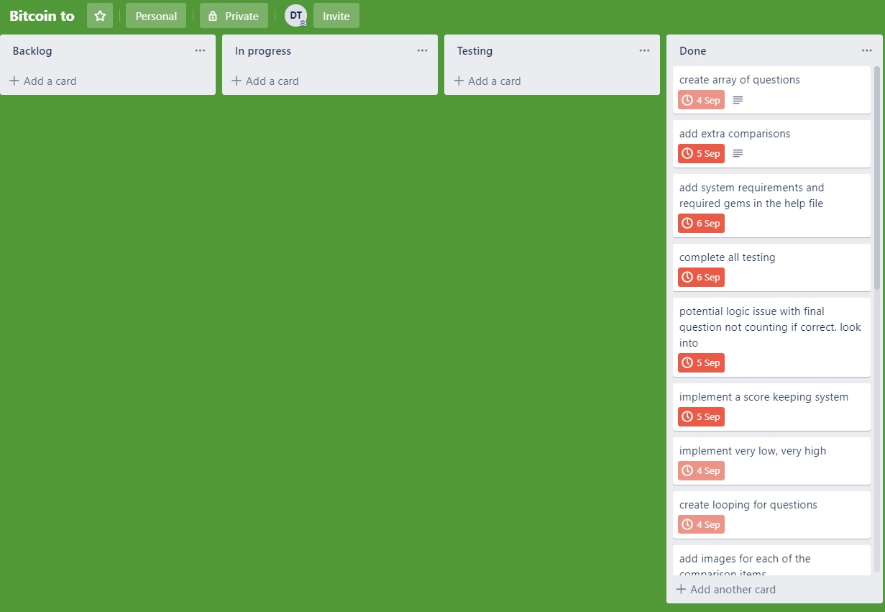
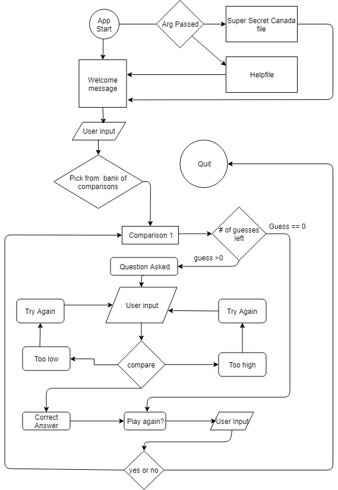

<h1>1 Bitcoin</h1>

Dale Thompson - September 2019

  

  <a href = "https://github.com/DBThompson713/bitcoin_to">1 Bitcoin on Github: https://github.com/DBThompson713/bitcoin_to</a>

<h2>Recommended System Requirements</h2>

• Windows, Linux or Mac OS
 • a keyboard
 • a monitor(wide screen preferred)
 • an internet connection

 
<h2>Required Ruby Gems</h2>

• net/http
 • json
 • io/console
 • catpix
 • colorize
 • rake
 • colorize

  

<strong><h2>Statement of Purpose and Scope</h2></strong>
  

1 Bitcoin is a guessing game based on the current bitcoin price. The game is essentially designed to be as frustrating and confusing as the bitcoin market can be.

This game is intended to be 100% satire. The intention is to poke fun, not to make a statement on bitcoin. 
  

1 Bitcoin asks the user to guess how many of a given item can be purchased for 1 bitcoin. It then takes the current value of 1 bitcoin and determines how many items can be purchased. The game then retakes and recalculates that value every time the user guesses. This causes the number that the user is trying to guess to fluctuate depending on the current volatility of the bitcoin market. The more volatile the market, the harder the game is to win. A correct answer may only be correct in that instance and have changed in the next. The game also intentionally keeps the user’s proximity to the correct answer somewhat vague and unclear to increase the level of frustration. 

To a person on the outside of the bitcoin scene, it can be quite daunting to understand how bitcoin value changes and what the real world implications of those changes are. Staring at a graph, it can be hard to visualise the real world purchasing power of a bitcoin and how much it can vary, however if the value differs in a few moments by several iphones or Nintendo switches, it becomes much easier to equate the value of one bitcoin to the world around us.

The target audience for this game is fans of bitcoin, people curious about bitcoin, as well as masochists. One type of user will play this game when they want to flex on their knowledge of bitcoin and purchasing power. Another type of user will play this game as a way to sate their curiosity regarding the bitcoin market. The last type of user for this game is someone who like to look at 8-bit pictures and make wild guesses.

 
<strong><h2>Features</h2></strong>
 
<strong>Live Bitcoin values</strong>
   
 •	Uses the current bitcoin value to determine how many items can be purchased. The current live bitcoin value is taken from blockchain, which is a reputable source. 
         o	This is accomplished by accessing the ticker located at https://blockchain.info/ticker and taking the last AUD value for bitcoin. This current value is updated whenever the ticker is accessed. 
         o	The ticker is accessed every time the user makes a guess, and the value may differ from the last read, meaning that the answer that the user is trying to guess may differ wildly from guess to guess, depending on the current bitcoin market volatility.
         o	But actual JSON access and parsing occurs in a method called blockchain, which is then called prior to each guess and used to calculate the actual number of items based on the per item value stored in index 1 of the questions array

<strong>8-bit graphics</strong>
 •	Each item, logo and meter is presented in beautiful 8-bit glory 
 o	1 bitcoin utilizes the catpix ruby gem to line by line convert images to their low-res 8-bit equivalent
 o	The image’s relative path is stored as a string located at index 2 of the questions array. That path is then dropped in as an argument to catpix.
 
  

<strong>User input</strong> 
•	Takes the user input and compares it to the actual number of items purchasable with 1 bitcoin
 o	Upon taking in the user input, first the input is checked to ensure that it is a number and not a string or single letter. The primary error handling is done at this point.

• If the input is found to be a character other than a number, a grumpy faced emoji is displayed and the user is told that they have not entered a number and that they have wasted a guess.
o	If a number is entered, the game determines whether or not they have the correct number, if not it then makes the following determinations in this order

1.	(guess+100) > answer  -- Way too high
 •	User told guess is way too high, and displays the corresponding image
 2.	guess> answer  -- Too high
 •	User told guess istoo high, and displays the corresponding image
 3.	(guess-100)answer – Way too low
•	User told guess is way too low, and displays the corresponding image
 4.	guess< answer – too low
 •	User told guess is too low, and displays the corresponding image
Session score

•	Each correct answer gives one point which is then stored in an outside variable called $score

•	Score is stored until the end of the game session

•	When exiting the game, the final score is first displayed.

<strong>Hidden Canadian Flag</strong>
 •	Running the application from the command line with the argument Canada will display a Canadian flag.
 o	O Canada.

  
<strong><h2>User Interaction and Experience</h2></strong>
•	The user can find the basic instructions on how to play by running the application from the command line and passing in the argument help: ruby index.rb help

•	If the user does not make use of the helpfile, the game is pretty easy to play. The questions are worded in a very straight forward way 
 o	Ex. How many Harley Davidsons can you currently purchase with 1 bitcoin?

•	The user enters their response as an integer.
 •	If the user enters something other than a number, the game will chastise the user, or ignore the answer and they will lose that guess. 
 •	The user input is verified as a number before any calculations are done, and handles any potential “error” which may be introduced by the user.

<h2>Workflow - Trello Board</h2>
<a href="https://trello.com/b/O9kLyot3/bitcoin-to">Trello Board: https://trello.com/b/O9kLyot3/bitcoin-to</a>

<h2>Flow Chart</h2>

<a href="https://drive.google.com/file/d/1JLGcrtCDS8WVB2zUd0DFyGUFJsM-bpuQ/view?usp=sharing">flowchart: https://drive.google.com/file/d/1JLGcrtCDS8WVB2zUd0DFyGUFJsM-bpuQ/view?usp=sharing</a>

 
Dale Thompson - September 2019 - Coderacademy Sydney